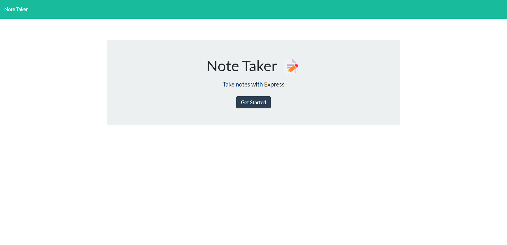

# Note Taking Tool 
This is a simple note-taking application that allows users to create, view, edit and delete notes.

## Getting Started
To use this application, simply clone this repository and run it on your local machine or click here: [Note Taker](https://aqueous-dawn-30920.herokuapp.com/)

## Install:
1. Clone the repository
2. Open the terminal and navigate to the project directory
3. Run npm install to install the dependencies
4. Run npm start to start the application
 

## Usage:
1. Open your web browser and navigate to http://localhost:3000
2. Click on the "Get Started" button
3. Start writing your note in the large right hand panel or create a new note by clicking on the + sign on the top right hand corner.
4. Save your note by clicking on the floppy disc icon
5. To edit an existing note, click on the note in the list and make the changes
6. To delete a note, click on the Delete button next to the note in the list

## Links:
* [Github Repo](https://github.com/Ale-Miret/note-taker)
* [Note Taker](https://aqueous-dawn-30920.herokuapp.com/)
